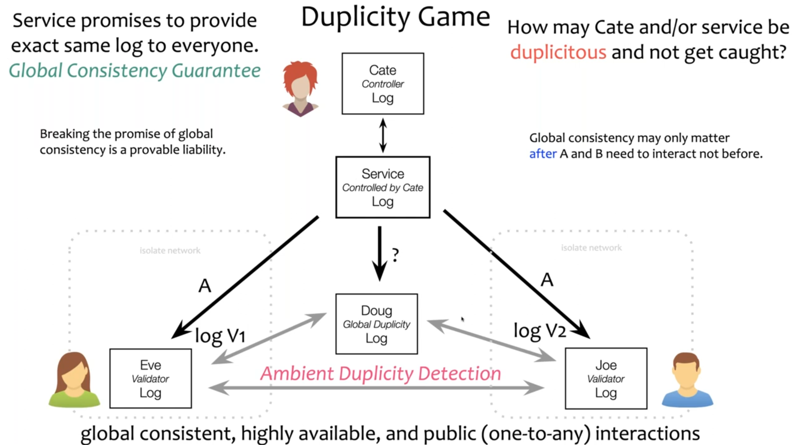

## How prefix is generated:

```
[random-seed] ---> >[stretch]--->[public key]--> 
>[generation] ---> [public key] (+) derivation = prefix
```
You're on the right track, but let's clarify some points to ensure a more accurate understanding of KERI's prefix concept:

**1. Signing the Prefix:**

* **You don't directly "sign the prefix"**: In KERI, you sign the *Key Event* itself, which includes the prefix. 
* **Private Key:** You use your private key to sign the Key Event, not the prefix directly.
* **Key Event:** The Key Event is a cryptographically secured record that contains information about your identity and how your keys are managed.

**2. Bob Gets the Key Event Log (KEL):**

* **KEL is NOT just a public key list:** The KEL is a chronological record of all your Key Events, not just your public keys. Each Key Event includes the prefix, public key, and other metadata.
* **Public Key in KEL:** Bob can obtain your current public key from the KEL by retrieving the latest Key Event.


**3. Verification Process:**

* **Matching Public Key:**  The derivation code in the Key Event is used to verify that the public key Bob retrieved from the KEL was indeed derived from the same private key used to create the Key Event. 
* **KEL Controller:** The KEL controller is the entity responsible for maintaining and managing the KEL.` This doesn't necessarily mean it's the same person as the data sender.`
* **Trust:** The verification process confirms that the person who sent the data and the entity controlling the KEL are using the same private key. However, this doesn't necessarily mean the KEL controller is trustworthy. Bob needs to establish trust in the KEL controller independently.

**In summary:**

* KERI uses Key Events to record and verify identity information.
* The prefix is part of the Key Event and helps identify the data sender.
* The derivation code allows verification of public keys in the KEL.
* Bob relies on the trust he has established in the KEL controller to ensure the authenticity of the public keys.

Remember that KERI is designed for decentralized trust and security. It's important to understand how the system works and to ensure you have appropriate trust in the entities involved. 


